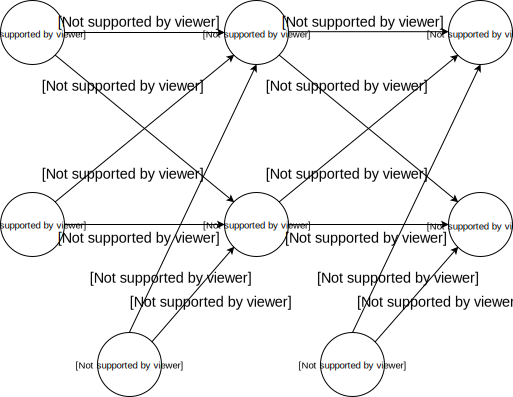
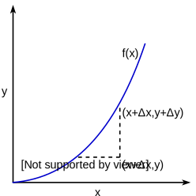
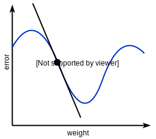

+++
title = "Neural Networks: An Introduction"
description = "An introduction to feed-forward neural networks with learning via back propagation."
date = 2018-01-19
draft = false
[extra]
toc = 0
+++

> For a well commented Javascript implementation of a simple neural network, check [this][nn-example] out. For some slides on neural networks that I made to be more focused on the general understanding, see [this][nn-slides].

A neural network consists of a number of layers, each containing _neurons_. Each neuron is connected to some (often all) of the neurons on the previous layer and the next layer. Each connection has a _weight_. A simple network consisting of two _input neurons_ (<katex>i_1</katex> and <katex>i_2</katex>), two _hidden neurons_ (<katex>h_1</katex> and <katex>h_2</katex>) and 2 _output neurons_ (<katex>o_1</katex> and <katex>o_2</katex>) connected by some _weights_ (<katex>w_1</katex> through to <katex>w_{12}</katex>) might look a bit like this:

Some points to note:

- _Bias_ neurons always emit a value of 1, but have a weight just like any other neuron. They exist so that the neurons connected to them can be _biased_ towards outputting a higher or lower value by virtue of the bias weight, irrespective of any input values.
- Every neuron except for the input neurons has both an input value and an output value, the output value being some function of the input value. Input neurons on the other hand only have an output value.

We input values to the network by setting the value that is output by each of the input neurons. Often, we normalise our input values so that they are always in the range [0..1] or [-1..1]. If the range is larger, everything will still work, but training may take longer.

We then work forwards one layer at a time: the input to a given neuron is the sum of the output from each connected neuron in the previous layer multiplied by the weight connecting it. As an example, the input value to neuron <katex>h_1</katex> is:

<katex>
in_{h1} = out_{i1}w_1 + out_{i2}w_3 + w_5
</katex>

For each neuron, we then convert its input value into an output value. This is what an _activation function_ does; it decides how active the neuron will be given the input to it (Note: we don't apply an activation function to the output from our input neurons). One choice for our activation function is the logistic function:

<katex>
sigmoid(x) = \frac{ 1 }{ 1 + e^{-x} }
</katex>

There are lots of other choices for the activation function. The activation function should be:

- Non-linear. If it's linear, then no matter how many layers we have, we can only end up with a linear mapping from input to output values. This means that a given output neuron can only separate inputs by some linear plane. Non-linearity allows a network to emulate arbitrarily complex functions given the right weights. Graphing the input against the output, a linear activation function gives each neuron the ability to plot an arbitrary straight line, but however many straight lines we combine we always end up with another straight line.
- Differentiable. This is in order that we can perform back propagation during training. There are probably caveats.

Every layer - and in fact every neuron - can have its own activation function. It's common for neural networks that have many layers to use different activation functions across different layers. In our example, we use the sigmoid activation function throughout.

To work out the _output_ from neuron <katex>h_1</katex> given its input, we just combine the above functions to get:

<katex>
out_{h1} = sigmoid(in_{h1}) = sigmoid(out_{i1}w_1 + out_{i2}w_3 + w_5)
</katex>

Once we have calculated the output value for each neuron in a layer, we move to the next layer forward and do the same again, using those outputs as our new inputs (remembering that the output from bias neurons is always 1). We are finished once we have computed the output values of our final layer of neurons. Given some inputs to the network, we now have a corresponding set of outputs from it.

# Training

On its own, a neural network isn't particularly interesting. It is simply a (big) function from some input values to some output values and nothing more. The goal of training is to work out what value of each of the weights connecting neurons to eachother should be.

Training a network requires:

- A _training set_. This is a set of mappings from input values to the output values we want to get back when they are passed in to the network. The training set should be representative of the mappings from inputs to outputs that you want the network to reproduce.
- An _error function_. We need to know how well the network did in producing the correct output given some input from our training set. For this, we use an error function. A good example is <katex>error = \sum\frac{1}{2}(expected - actual)^2</katex>, where we sum the squared difference between each _actual_ output value and the output value we _expected_. The <katex>\frac{1}{2}</katex> makes no difference other than making the differential of the error function neater, which will come in handy.
- A means to work out how to update each weight in the network in order to reduce this error. This is where _back propagation_ comes in.

There are two aspects to training a network. Firstly, we want to figure out how to update each weight in order to try and reduce the total error of the network given some training sample. The dominant technique here is _back propagation_. Secondly, we want to decide how to actually apply our proposed updates. I'll talk about each step in order.

## Back Propagation

Finding out how to update each weight in the network to reduce the total error is achieved using a method called _back propagation_. Given some training sample - a single mapping from inputs to outputs - we want to work out how to adjust each of the weights in the network in order to minimise the error between the expected outputs and the actual ones produced by the network given these inputs.

The key intuition for me here is that this mapping from input values to some total error is simply one big function. To illustrate this, here is a function based on the network illustrated above that goes all the way from our two initial inputs to our error value, broken down into parts using variables to be more readable:

First, we see that the total error in the network is based on the difference between our expected and actual output values:

<katex>error = \frac{1}{2}(expected_{o1} - out_{o1})^2 + \frac{1}{2}(expected_{o2} - out_{o2})^2</katex>

...those output values are actually just functions of the input values to those neurons:

<katex>out_{o1} = sigmoid(in_{o1})</katex>

<katex>out_{o2} = sigmoid(in_{o2})</katex>

...which in turn are functions of the output values from the previous layer and the weights connecting them:

<katex>in_{o1} = out_{h1}w_7 + out_{h2}w_9 + w_11</katex>

<katex>in_{o2} = out_{h1}w_8 + out_{h2}w_10 + w_12</katex>

...and _those_ output values are also just functions of the input values:

<katex>out_{h1} = sigmoid(in_{h1})</katex>

<katex>out_{h2} = sigmoid(in_{h2})</katex>

...which are functions from our actual input to the network and the weights connecting them:

<katex>in_{h1} = out_{i1}w_1 + out_{i2}w_3 + w_5</katex>

<katex>in_{h2} = out_{i1}w_2 + out_{i2}w_4 + w_6</katex>

So, if we set the input neurons to be outputting some values <katex>out_{i1}</katex> and <katex>out_{i2}</katex>, and use current value of each weight in the network, we can calculate what the error is.

So, a neural network is _just a function_, and the goal is to find out how much the error changes with respect to some change to each weight. Given this, we know how to update each weight in order to reduce the error for the given training sample. Well, this is exactly what _differentiation_ is for. As such, it forms the core of how back propagation works.

### Differentiation

Differentiation is the act of finding out how much one value changes with respect to some other value. Visualising some function <katex>y = f(x)</katex>, We can see how for some change in a value of <katex>x</katex> that we'll call <katex>\Delta{x}</katex>, there is a corresponding change in <katex>y</katex>, <katex>\Delta{y}</katex>:

The slope here is simply <katex>\frac{\Delta{y}}{\Delta{x}}</katex> - The change in <katex>y</katex> with respect to <katex>x</katex>.

As we make <katex>\Delta{x}</katex> smaller, <katex>\Delta{y}</katex> becomes smaller as well, and the slope <katex>\frac{\Delta{y}}{\Delta{x}}</katex> gets closer and closer to being equal to the slope at the point <katex>(x,y)</katex>. The function that returns the value of this slope at some value of <katex>x</katex> is referred to as <katex>f'(x)</katex> or <katex>\frac{dy}{dx}</katex>.

For some differentiable function <katex>f(x)</katex>, the following is true:

<katex>
f'(x) \approx \frac{\Delta{y}}{\Delta{x}} = \frac{ f(x + \Delta{x}) - f(x) }{ \Delta{x} }
</katex>

Where the difference between <katex>f'(x)</katex> and <katex>\frac{\Delta{y}}{\Delta{x}}</katex> is infintesimal.

Although the function we have to differentiate is more complex, the goal is the same. We want to find the gradient showing how a change in some weight will lead to a change in the total error.

Given the current value of some weight, if the slope we find is positive, it means that increasing the weight will lead to an increase in error, and if it is negative, the reverse is true. Our goal then is to adjust the weight so as to move down the slope, leading to a decrease in the error.

Two things in our differentiation toolbox which come in particularly handy for finding the change in error with respect to some weight are:

1. The _chain rule_, which states that for <katex>a = f(b)</katex> and <katex>b = g(x)</katex>, <katex>\frac{da}{db}.\frac{db}{dx} = \frac{da}{dx}</katex>. That is to say, if we know <katex>f'(b)</katex> and <katex>g'(x)</katex>, we can just multiply them together to find the change in <katex>a</katex> with respect to <katex>x</katex>.
2. When we are differentiating with respect to some weight, any part of the equation which is not affected by the change in weight can be treated like a constant, and so be ignored. This allows us to ignore much of our big network equation when we are calculating the change for any given weight.

### The Back Propagation Algorithm

An overview of the steps we will take are:

1. Run some training input through the network, so that we have values for all of our neuron inputs and outputs, as well a total error value. We'll use these values to help fill in the equations in subsequent steps.
2. Differentiate each weight in our network with respect to the error. For each weight, this gives us a function which we can provide the current value of the weight to in order to find the slope with respect to our error. We use this slope to figure out in which direction (and how much, depending on how steep the slope is) to alter the weight in order to try and reduce the total error.

We find that working backwards through the network saves us a lot of effort, since we reuse a lot of the calculations done on previous layers. By doing this, we end up _propagating the change in error backwards_, hence the name _back propagation_.

Let's look to update <katex>w_7</katex> as an example.

Our aim is to differentiate everything down to the weight we are interested in with respect to the thing that contains the weight. We can then chain together our results as per the chain rule, to find out how the total error changes with respect to the weight, or in other words, <katex>\frac{d(error)}{d(out_{w_7})}</katex>.

To begin with, we need to differentiate the total error with respect to <katex>out_{o1}</katex>, since if we were to expand out <katex>out_{o1}</katex>, we would notice that it contains <katex>w_7</katex>:

<katex>error = \frac{1}{2}(expected_{o1} - out_{o1})^2 + \frac{1}{2}(expected_{o2} - out_{o2})^2</katex>

<katex>\frac{d(error)}{d(out_{o1})} = -1(expected_{o1} - out_{o1}) = out_{o1} - expected_{o1}</katex>

We then want to differentiate <katex>out_{o1}</katex> with respect to <katex>in_{o1}</katex>:

<katex>out_{o1} = sigmoid(in_{o1})</katex>

<katex>\frac{d(out_{o1})}{d(in_{o1})} = sigmoid(in_{o1})(1 - sigmoid(in_{o1}))</katex>

Finally, we want to differentiate <katex>in_{o1}</katex> with respect to <katex>w_7</katex>:

<katex>in_{o1} = out_{h1}w_7 + out_{h2}w_9 + w_11</katex>

<katex>\frac{d(in_{o1})}{d(w_7)} = out_{h1}</katex>

We treat any variables not containing our weight as constant, since they will always remain the same no matter the value of the weight. This means that upon being differentiated, they simply disappear. Having differentiated all the way down to the weight of interest, we multiply our results together as per the chain rule and end up with:

<katex>\frac{d(error)}{d(out_{w_7})} = (out_{o1} - expected_{o1}) \times sigmoid(in_{o1})(1 - sigmoid(in_{o1})) \times out_{h1}</katex>

Given that we now know how much the error changes with respect to this weight, we work out what the new value of the weight should be:

<katex>w_7^{new} = w_7 - \alpha\frac{d(error)}{d(out_{w_7})}</katex>

Where <katex>\alpha</katex> is some constant which determines how aggressively to update our weights. A smaller value leads to slower learning, but a bigger value might jump over the best weights and stop our network from improving as much. It can take some experimentation to arrive at the best value.

Let's now look at updating <katex>w_1</katex>, which is one layer back.

First, we want to differentiate the error, but this time we note that <katex>w_1</katex> appears in both <katex>out_{o1}</katex> and <katex>out_{o2}</katex>, so we'll end up with two chains - one going through each of these outputs - that we'll need to add together in order to get the total effect of our weight.

We therefore need to differentiate the error with respect to each input, the values for which we can reuse from having worked things out for the next layer forward:

<katex>error = \frac{1}{2}(expected_{o1} - out_{o1})^2 + \frac{1}{2}(expected_{o2} - out_{o2})^2</katex>

<katex>\frac{d(error)}{d(in_{o1})} = \frac{d(error)}{d(out_{o1})} . \frac{d(out_{o1})}{d(in_{o1})}</katex> (both of which we've worked out already)

<katex>\frac{d(error)}{d(in_{o2})} = \frac{d(error)}{d(out_{o2})} . \frac{d(out_{o2})}{d(in_{o2})}</katex> (both of which we've worked out already)

And then each input with respect to <katex>out_{h1}</katex>:

<katex>in_{o1} = out_{h1}w_7 + out_{h2}w_9 + w_11</katex>

<katex>\frac{d(in_{o1})}{d(out_{h1})} = w_7</katex>

<katex>in_{o2} = out_{h1}w_8 + out_{h2}w_10 + w_12</katex>

<katex>\frac{d(in_{o2})}{d(out_{h1})} = w_8</katex>

And then <katex>out_{h1}</katex> with respect to <katex>in_{h1}</katex>, which is similar to what we did previously:

<katex>out_{h1} = sigmoid(in_{h1})</katex>

<katex>\frac{d(out_{h1})}{d(in_{h1})} = sigmoid(in_{h1})(1 - sigmoid(in_{h1}))</katex>

Finally, we can differentiate <katex>in_{h1}</katex> with respect to our weight of interest <katex>w_1</katex>:

<katex>in_{h1} = out_{i1}w_1 + out_{i2}w_3 + w_5</katex>

<katex>\frac{d(in_{h1})}{d(w_1)} = out_{i1}</katex>

Remembering that we now have two sets of values to chain together (because there are two output values that we had to differentiate with respect to) we end up needing to compute:

<katex>\frac{d(error)}{d(w_1)} = \frac{d(error)}{d(in_{o1})} . \frac{d(in_{o1})}{d(out_{h1})} . \frac{d(out_{h1})}{d(in_{h1})} . \frac{d(in_{h1})}{d(w_1)} + \frac{d(error)}{d(in_{o2})} . \frac{d(in_{o2})}{d(out_{h1})} . \frac{d(out_{h1})}{d(in_{h1})} . \frac{d(in_{h1})}{d(w_1)}</katex>

We can rearrange this to be:

<katex>\frac{d(error)}{d(w_1)} = (\frac{d(error)}{d(in_{o1})} . \frac{d(in_{o1})}{d(out_{h1})} + \frac{d(error)}{d(in_{o2})} . \frac{d(in_{o2})}{d(out_{h1})}) . \frac{d(out_{h1})}{d(in_{h1})} . \frac{d(in_{h1})}{d(w_1)} </katex>

Substituting in our working out (except those values worked out on the next layer forward, which we just reuse), this boils down to:

<katex>\frac{d(error)}{d(w_1)} = (\frac{d(error)}{d(in_{o1})}w_7 + \frac{d(error)}{d(in_{o2})}w_8) \times sigmoid(in_{h1})(1 - sigmoid(in_{h1})) \times out_{i1}</katex>

As before, we can now work out the new value of our weight by travelling some small amount in the opposite direction of the slope:

<katex>w_1^{new} = w_1 - \alpha\frac{d(error)}{d(w_1)}</katex>

However many hidden layers the network has, the steps that we run through are the same. For weights connected to output neurons our job is quite simple, and otherwise we end up adding errors propagated from the next layer forward multiplied by the corresponding weights connecting them, and then differentiating the rest of the way down from there as we've done above.

We repeat this back propagation process for all of our weights, at which point we know how to update every weight in order to reduce the error given the training sample we used.

## How to apply our updates

Using back propagation, we can provide a training sample to the network, and find out how to alter each weight in it in order to reduce the error for that sample. We have a few options for how to make use of this information:

- We apply all of our proposed updates immediately after completing the back propagation step. This is known as _stochastic gradient descent_.
- We save up proposed updates for some batch of training samples, and then for each weight, we take the average of the proposed updates that we have saved up for it and apply that. This is known as _mini-batch gradient descent_, and has the advantage of nudging each weight in a direction that is the best on average for each training sample in this batch, but the disadvantage that we have to do a bunch more work before each actual update.
- We take _mini-batch_ to the extreme, and save up proposed updates as we look at the entire training set, applying the average updates once at the end. This is known as _batch gradient descent_.

_Mini-batch_ is a common choice, as it is a good compromise in terms of performance and amount of computation required.

# Summary

A neural network boils down to being a big function which, given some inputs, produces some outputs. By altering the weights in the network, we can shape this function in order produce an almost arbitrary mapping between input and output values.

Training a network involves teaching the it what output values to expect given some input values. For each pair of input and output values in a training set, we want to figure out how to update each weight in the network so as to reduce the total error. By differentiating the error with respect to each weight we can find out how to adjust each weight in order to achieve this.

We then apply our proposed weight updates either immediately, or after some number of training samples has been seen, in order to reduce the total error between actual and expected outputs. Eventually, we hope that the network error will reduce to an acceptable level over the course of this training, at which point we consider it trained. Hopefully, the network will then be able to produce the expected outputs given some input valuess have not been seen during training; this is the true test of how well it has been trained.

Almost every aspect of how a network works can be modified to suit specific needs:
- The activation function of each neuron (As an example, _tanh_ is generally considered better than the sigmoid function we used here).
- How many layers there are, and how many neurons per layer.
- Which connections exist between neurons on different layers.
- The error function used to calculate our total network error.
- The training algorithm itself! Back propagation with something like mini-batch gradient descent is the dominant choice, but there are other ways to update our weights (for example, genetic algorithms).

As such, there is an almost endless amount of exploration one can do. That said, I hope that this post helps to build a foundation on which this exploration can be carried out.

[nn-example]: https://github.com/jsdw/neural-net-example
[nn-slides]: https://github.com/jsdw/neural-network-talk